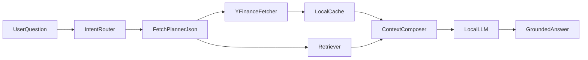

# Personal stock Q&A app (improved plan)

## Key improvements over the first version

- Add a **strict planner contract**: the model outputs JSON only (tickers, modules, date range), validated before any fetch.
- Add a **freshness policy** per field type (realtime, same-day, slow-changing) so answers stay accurate while avoiding unnecessary calls.
- Add **grounded answer formatting** with data timestamps and source bullets to reduce hallucinations.
- Add a **small eval harness** for regression testing as prompts/routing evolve.
- Keep the app personal/simple: local storage, no distributed infra, single-request execution.

## Architecture

## Project files to create

- `[src/config.py](src/config.py)`: model names, cache TTLs, Chroma path, default answer mode.
- `[src/schemas.py](src/schemas.py)`: Pydantic models for planner JSON and normalized fetch payload.
- `[src/fetcher.py](src/fetcher.py)`: ticker extraction, fetch modules (`quote`, `history`, `fundamentals`), retry/timeout and field whitelists.
- `[src/rag.py](src/rag.py)`: chunking, embedding, Chroma ingest/search with metadata filters.
- `[src/llm.py](src/llm.py)`: Ollama chat + planner prompts.
- `[src/pipeline.py](src/pipeline.py)`: orchestration (route -> fetch/retrieve -> compose -> answer).
- `[src/app.py](src/app.py)`: Streamlit UI (question box, mode toggle, debug context panel).
- `[tests/test_fetcher.py](tests/test_fetcher.py)`: fetch profile mapping and payload limits.
- `[tests/test_pipeline.py](tests/test_pipeline.py)`: end-to-end smoke tests with mocked fetcher.
- `[eval/questions.yaml](eval/questions.yaml)`: curated Q&A checks.
- `[scripts/eval.py](scripts/eval.py)`: run evaluation locally and report pass/fail.

## Intelligent fetcher design

1. Extract symbols with regex + watchlist and optional confirmation when ambiguous.
2. Build fetch plan in two layers:
  - deterministic rules for obvious intents (price, moving average, compare),
  - optional LLM planner returning strict JSON for complex prompts.
3. Validate planner output with Pydantic; on failure, fall back to deterministic rules.
4. Enforce payload budgets:
  - whitelist only required `info` fields,
  - truncate long text fields,
  - cap multi-ticker requests per question.

## Freshness and caching policy

- Realtime fields (`price`, `day_change`, short history): fetch every request.
- Daily fundamentals snapshots: cache with TTL (for example 6 to 24 hours).
- Long profile text and static metadata: cache longer (for example 7 days).
- Persist cache locally in a simple sqlite/json layer for personal-use convenience.

## RAG scope and metadata

- Retrieve only supportive context (company summaries, your notes, prior analysis), never as sole source for realtime prices.
- Store metadata for each chunk: `ticker`, `source`, `as_of`, `doc_type`.
- Retrieval query applies ticker filter when symbols are detected to improve precision.

## Answer contract

- Require the model to output:
  - direct answer,
  - bullet list of key numbers with `as_of` timestamps,
  - short “what I used” sources section.
- If live fetch fails, clearly state partial answer and missing data instead of guessing.

## Validation and quality loop

- Add 20 to 30 representative questions to `[eval/questions.yaml](eval/questions.yaml)`:
  - realtime quote, fundamentals lookup, comparison, ambiguous ticker, and “I do not know” cases.
- Run `[scripts/eval.py](scripts/eval.py)` after prompt/router changes.
- Track simple metrics: answer completeness, stale-data incidents, and fetch errors.

## Implementation order

1. Build deterministic fetcher + Ollama answer path (no RAG yet). **Done** (`pipeline`, `llm`, Ask tab).
2. Add planner JSON schema and fallback behavior. **Pending** (`schemas.FetchPlan` exists; LLM planner not wired).
3. Add RAG ingest/retrieve with metadata filtering. **Done** — `[src/rag.py](src/rag.py)`: Chroma under `data/chroma/`, Ollama embeddings (`nomic-embed-text`), `ticker` / `as_of` / `doc_type` / `source` metadata; `[src/pipeline.py](src/pipeline.py)` merges live JSON (authoritative) + retrieval (background).
4. Add freshness cache and grounded answer format. **Pending** (TTL cache); grounding prompt strengthened in pipeline.
5. Streamlit UI with Ask + Metrics + RAG toggles. **Done**; eval scripts still **pending**.

